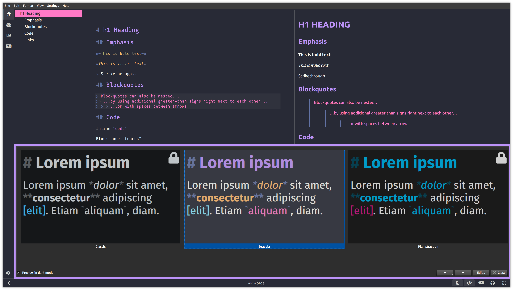

### [ghostwriter](https://wereturtle.github.io/ghostwriter/)

#### Install using Git

If you are a git user, you can install the theme and keep up to date by cloning the repo:

    $ git clone https://github.com/dracula/ghostwriter.git

#### Install manually

Download using the [GitHub .zip download](https://github.com/dracula/ghostwriter/archive/master.zip) option and unzip them.

#### Activate theme

##### Copy theme to ghostwriter config directory

On UNIX-based systems (GNU/Linux, macOS, BSD-variants) the following should work:

`mkdir -p ~/.config/ghostwriter/themes/Dracula && cp ghostwriter/theme.cfg ~/.config/ghostwriter/themes/Dracula/theme.cfg`

Otherwise manually create directory `Dracula` in ghostwriter config directory `theme` and copy `theme.cfg` there

##### Activate theme in ghostwriter

Go to `Settings | Themes...`, select `Dracula`

